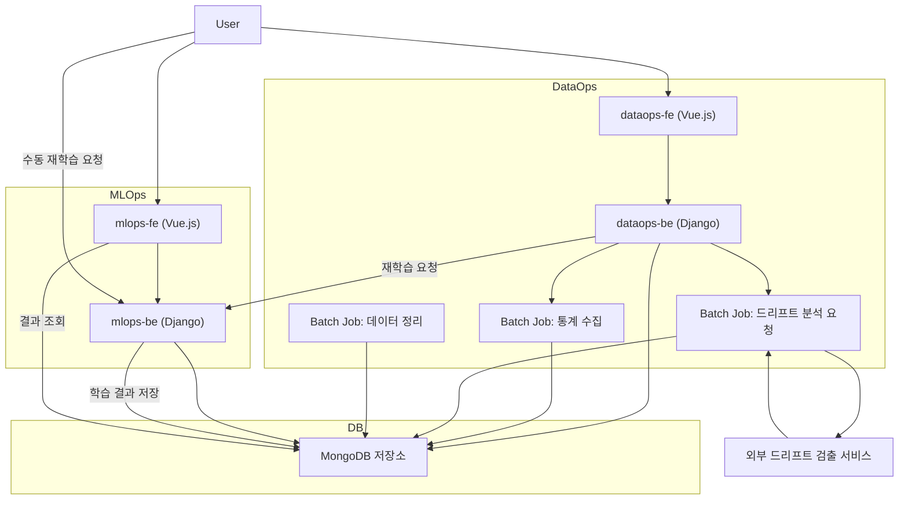

# datadrift_pipeline

## 주소
- https://github.com/keti-datadrift/datadrift_pipeline.git

## 개요
- 데이터 드리프트 관리 기술의 파이프라인 기술(DataOps, MLOps Pipeline)입니다.
- 개발 및 유지 관리 기관 : __(주)다이퀘스트__
- 최종 검토 기관 : 한국전자기술연구원(KETI)

## 프로젝트 구성
이 프로젝트는 "분석 모델의 성능저하를 극복하기 위한 데이터 드리프트 관리 기술 개발" 과제를 위한 학습 데이터 자동 재구성(DataOps) 및 분석 모델 자동 재학습(MLOps) 플랫폼입니다.  
주요 구성은 다음과 같습니다:

- `dataops-be/`: 학습 데이터 등록, 관리, 편집 기능을 제공하는 백엔드 서버 (Django 기반)
- `dataops-fe/`: 데이터 등록 및 관리 기능을 위한 사용자 인터페이스 (Vue.js 기반)
- `mlops-be/`: 분석 모델의 학습, 파라미터 관리, 테스트 등을 담당하는 백엔드 서버 (Django 기반)
- `mlops-fe/`: 학습 결과 시각화 및 사용자 제어 기능을 제공하는 프론트엔드 (Vue.js 기반)
- `sample_data/`: 테스트 및 시뮬레이션용 샘플 데이터 디렉토리

## 기술 스택
본 프로젝트는 다음 기술들을 기반으로 구축되었습니다:

- **MongoDB**: 학습 데이터 및 모델의 원천데이터 및 메타데이터 저장소로 사용
- **Django**: DataOps 및 MLOps 백엔드 서비스 구현
- **Vue.js**: 사용자 인터페이스 구현을 위한 프론트엔드 프레임워크

## 시스템 아키텍처

## MongoDB 설정
- 이 프로젝트는 Docker를 사용하여 MongoDB를 설정합니다. 따라서 Host Server에 Docker가 설치되어 있어야 합니다. 설치되어 있지 않다면 [Docker 공식 웹사이트](https://www.docker.com/get-started)에서 운영체제에 맞는 버전을 설치해 주세요.

## Acknowledgements (사사)
- 이 연구는 2024년도 정부(과학기술정보통신부)의 재원으로 정보통신기획평가원의 지원을 받아 수행된 연구임 (No. RS-2024-00337489, 분석 모델의 성능저하 극복을 위한 데이터 드리프트 관리 기술 개발)
- This work was supported by Institute of Information & communications Technology Planning & Evaluation (IITP) grant funded by the Korea government(MSIT) (No. RS-2024-00337489, Development of data drift management technology to overcome performance degradation of AI analysis models)

